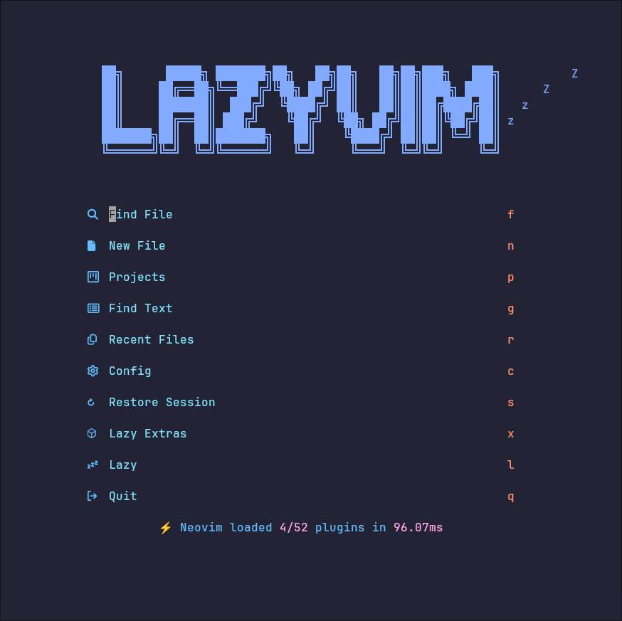
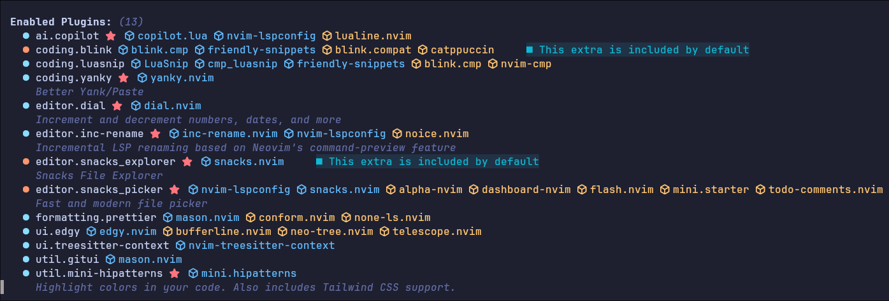
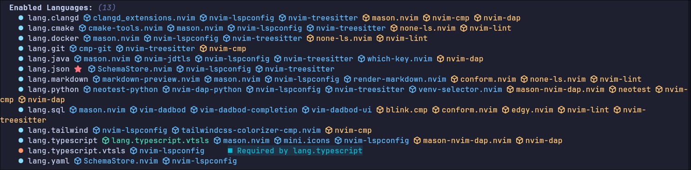

# Descubrimientos de Nvim

Hemos logrado realizar cambios importantes dentro de nvim, especialmente dentro
de nuestro dispositivo principal **Debo de destacar** que ya no usaremos mas
el formato de texto `txt` Ahora usaremos el formato markdown, que es más
estético y acorde a nuestras nuevas notas.
Es por ello que para entender mejor el asunto debemos de consultar paginas
especiales enfocadas en la descripción de uso de markdown

```markdown
Las paginas mas usuales en español tienen el estilo de:
[markdown en español](https://www.markdownlang.com/es/)
```

Estas son las nuevas consideraciones que de debemos de conocer en caso de que
queramos replicar esta configuración dentro de nuestro entorno virtual de
Debian 12

- Debemos de descargar de buena fuente la version mas estable
  de nvim.
- Si tenemos algo ya construido se recomienda respaldar la información.
- [ ] Estos son los pasos que se deben de seguir.

```bash
mv ~/.config/nvim ~/.config/nvim.bak
# estas tres que continúan a continuación se recomiendan :
mv ~/.local/share/nvim ~/.local/share/nvim.bak 2>/dev/null
mv ~/.local/state/nvim ~/.local/state/nvim.bak 2>/dev/null
mv ~/.cache/nvim ~/.cache/nvim.bak 2>/dev/null

# Se recomienda traer a LazyVim starter
git clone https://github.com/LazyVim/starter ~/.config/nvim
rm -rf ~/.config/nvim/.git

# Posteriormente se debe de entrar a nvim para cargar las configuraciones

```

- Al momento de abrir nvim, podemos ver algo como:



## Sección de plugins instalados

- Dentro debemos de asegurarnos en entrar en la sección de plugins pulsando x
- debemos de posteriormente seleccionar pulsando sobre las lineas
  correspondientes a nuestras elecciones `x` para que se
  coloquen al inicio de la instalación.
- [ ] Estas son las secciones que nuestro entorno principal posee:
      
      **aquí tenemos otra vista mas**



### Sección de características de nvim

- Cuando veas **letras juntas** (ej. dd), se presionan una tras otra rápidamente.
- Cuando veas el signo _+_ como `Ctrol + v`, se deben de presionar al mismo tiempo

- [ ] 🚀 Movimiento Avanzado (Familia g y saltos)

1. `gg`: Va a la primera linea del archivo.
2. `G`: Va a la última línea del archivo.
3. `gd`: Va a la definición de la variable o función bajo el cursor.
4. `gi`: Regresa al último lugar donde estabas escribiendo.
5. `%`: Salta entre la llave { y la llave } correspondiente "ideal en c"

- [ ] ✏️ Modificar y Reemplazar (Familia c)

1. `cw`: Borra la palabra actual y entra en modo insertar.
2. `cc`: Borra toda la linea y entra en mode insertar.
3. `c$`: Borra desde el cursor hasta el final de la línea y entra
   en modo insertar.

- [ ] 🗑️ Borrar y Cortar (Familia d)

1. `dw`: Borrar la palabra actual.
2. `dd`: Borrar la linea completa.
3. `d$`: Borrar desde el cursor hasta el final de la linea.

- [ ] 📋 Copiar y Pegar (Familia y y p)

1. `yw`: copia la palabra actual.
2. `yy`: Copia la linea completa.
3. `p`: pega el texto copiado/borrado **después** del cursor o en la línea
   de abajo.
4. `P`: pega el texto copiado/borrado **antes** del cursor o en
   la linea de arriba.

- [ ] 👁️ Selección de Texto (Familia v)

1. `v:` Selección normal (carácter por carácter).
2. `V:` Selección de líneas completas.
3. `Ctrl + v`: Selección en bloque/columna (útil para editar varias líneas a la vez).

- [ ] 🔍 Errores y Ortografía (Familia z y corchetes)

1. `z=`: Abre la lista de sugerencias del diccionario.
2. `zg`: Agrega la palabra bajo el cursor al diccionario personal.
3. `]d`: Salta al siguiente error de código (clangd).
4. `[d`: Regresa al error de código anterior.
5. `]s`: Salta a la siguiente palabra con error de ortografía.
6. `[s`: Regresa a la anterior palabra con error de ortografía.

- [ ] 🪄 Super-Atajos Combinados (Para código en C)

1. `ci{`: Borra todo el código dentro de las llaves {} y te deja escribiendo dentro.
2. `di{`: Borra todo el código dentro de las llaves {} pero te mantiene en Modo Normal.
3. `ci(`: Borra los argumentos dentro de los paréntesis () y te deja escribiendo dentro.
4. `di"`: Borra el texto dentro de las comillas de un printf("texto").
