# Introducción a git + carpetas de proyectos NVIM

Cuando interactuamos con GitHub, necesitamos demostrar que somos el dueño del repositorio.
**Existen 2 formas de poder hacerlo**

- [ ] Método antiguo:
      Básicamente es usar https, pero te obliga identificarte en cada git push;
      que realices

- [x] Método Actual:
      Utilizando llaves criptográficas: que básicamente es una llave privada que
      se queda en tu SO junto con una llave publica que subimos a GitHub.

## Pasos a seguir para configurar la llave SSH

1. Necesitamos abrir una terminal, en nuestro caso UBUNTU 24 y ejecutaremos
   el siguiente comando, el cual tiene la idea de generar la llave ssh:

```bash

ssh-keygen -t ed25519 -C "197368385+JosePabloGith@users.noreply.github.com"

# Presiona Enter cuando te pida la ruta (para aceptar ~/.ssh/id_ed25519).
# Presiona Enter dos veces más para dejar la contraseña en blanco
# (y así permitir que el script interactivo trabaje en segundo plano
# de forma dinámica sin interrumpirte).

```

- vistazos ejemplo 1

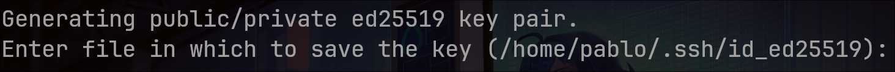

- Configura Tu GIT LOCAL con ese mismo correo

```bash

git config --global user.name "JosePabloGith"
git config --global user.email "197368385+JosePabloGith@users.noreply.github.com"


```

## FLUJO DE TRABAJO CON GITHUB

Imagina que acabas de terminar de escribir tus apuntes de la clase de SO
dentro de Nvim y quieres subirlos. Esto es lo que en teoría debes de
realizar:

1. **DEBES DE ASEGURARTE DE ESTAR DENTRO DE LA RAÍZ DEL REPOSITORIO**
   Git siempre necesita que los comandos principales se ejecuten desde la
   carpeta en donde se inicializó el repositorio
   (típicamente donde vive la carpeta oculta .git)

```bash

# digamos que es algo como cd ~/Mis_notas

# [*] Antes de hacer algo, es buena practica ver que archivos se han
#     modificado, creado o borrado
git status

# una ves ubicados los archivos que vas a actualizar
# debes de hacer suponiendo que creamos Cursos/SistemasOperativos..
git add Cursos/SistemasOperativos/

# es buena practica verificar nuevamente que los archivos
# se han seleccionado en el orden que queríamos
git status  # debería de verse todo en verde

# después debemos de comentar que es lo que realizamos

git commit -m "documentos: apuntes de ejemplo SO "

# para finalizar con broche de oro debemos de enviarlos a GitHub
# en este punto debemos de tener lista la llave ssh
git push origin main

```

- Ahora, la idea es generar un directorio general
  que servirá para alojar todos los directorios relacionados
  a diferentes materias, de modo que podamos tener un mejor control
  tanto en la maquina principal que poseemos como en
  cualquier maquina que use un sistema UNIX, como es el caso
  de la maquina virtualizada que usamos dentro de la universidad.

- Este es el plan a seguir

```bash

# crearemos la carpeta general dentro de nuestra maquina anfitrión
mkdir ~/Documentos/mis-notas-universitarias

# cambiaremos a ella
cd ~/Documentos/mis-notas-universitarias

# dentro de ella podremos inicializar git una sola vez
# este sera el repositorio que se reflejara dentro de GitHub
git init -b main

# en caso de ser tan cabeza nabo debemos de mover todas las carpetas
# relacionadas con la universidad, cuidando la forma en la cual
# las vamos a agrupar, de forma que sea mas fácil trabajar.

# posteriormente al hacer git push, se reflejaran de manera adecuada
# los directorios que almacenan la información de las materias en
# cuestión, TODO AL ALCANCE DE LA MANO

git push

# es recomendable configurar un .gitignore para
# que no existan problemas después

```

```gitignore

# === Configuración para proyectos en C ===
# Ignorar todos los archivos ejecutables compilados dentro de
# carpetas bin

**/bin/*
# Excepto si hay un archivo .gitkeep para mantener la carpeta viva
!**/bin/.gitkeep

# Ignorar archivos objeto y de biblioteca compilados
*.o
*.out

# === Configuraciones de Editores y Notas ===
.obsidian/workspace.json
.obsidian/graph.json
*.swp
*.swo
*~
.netrwhist

# === Archivos basura del sistema ===
.DS_Store
Thumbs.db

```

- tenemos que tener en mente que si hay carpetas sin contenido
  al momento de hacer `git push` estas carpetas se eliminaran
  es por ello que si buscamos mantenerlo, debemos de ejecutar
  esta serie de comandos, "o algo parecido".

```bash

# Para el ejemplo de pipes
touch so/comunicacion_entre_procesos/pipes/ejemplo1/{bin,include}/.gitkeep

# Para herencia de procesos
touch so/herencia_procesos/{bin,include}/.gitkeep

# Para la práctica 1
touch so/practicas/practica_1/ejemplo_base/{bin,include}/.gitkeep

# Para el scheduler
touch so/sheduler/introduccion/ejemplo_introductorio/{bin,include}/.gitkeep

# posteriormente se debe de verificar el estado con:
git status

```

- ejemplo visual de `git status`

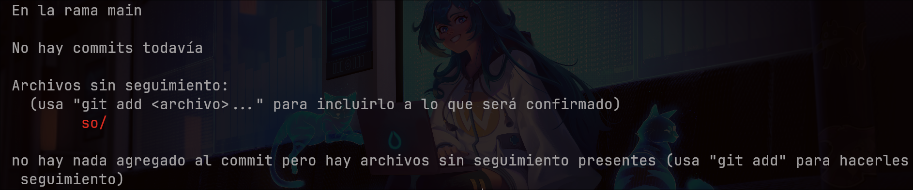

- tenemos que agregarlo usando git add

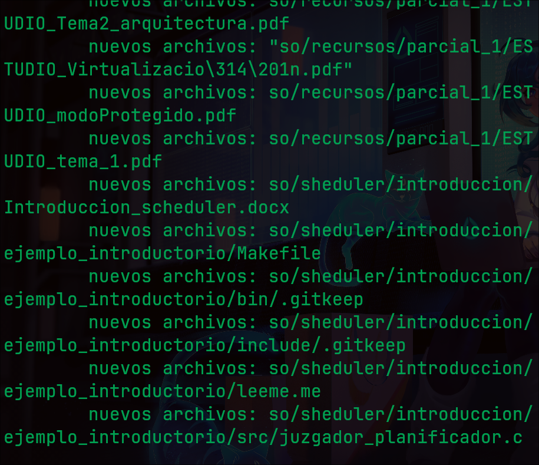

- posteriormente se debe de comentar usando git commit -m "comentario"

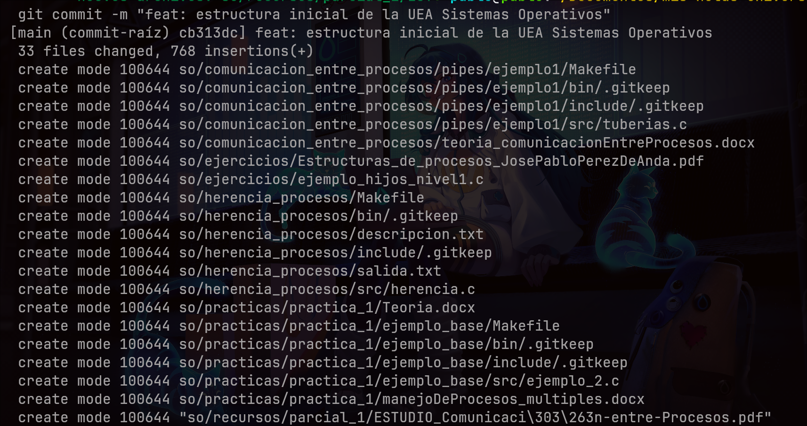

- Finalmente se debe de subir con git push
  `considerando que debemos tener configurada la contraseña`
  previamente.

1. Debemos de ir a GitHub, iniciar sesión con la cuenta
   principal que usaremos
2. Debemos de hacer clic en **new**
3. En **Repository name** debemos de colocar
   exactamente el nombre del directorio a alojar
   en este caso será mis-notas-universitarias
4. Debemos de elegir si queremos que sea publico
   o privado, en este caso lo dejare en publico.

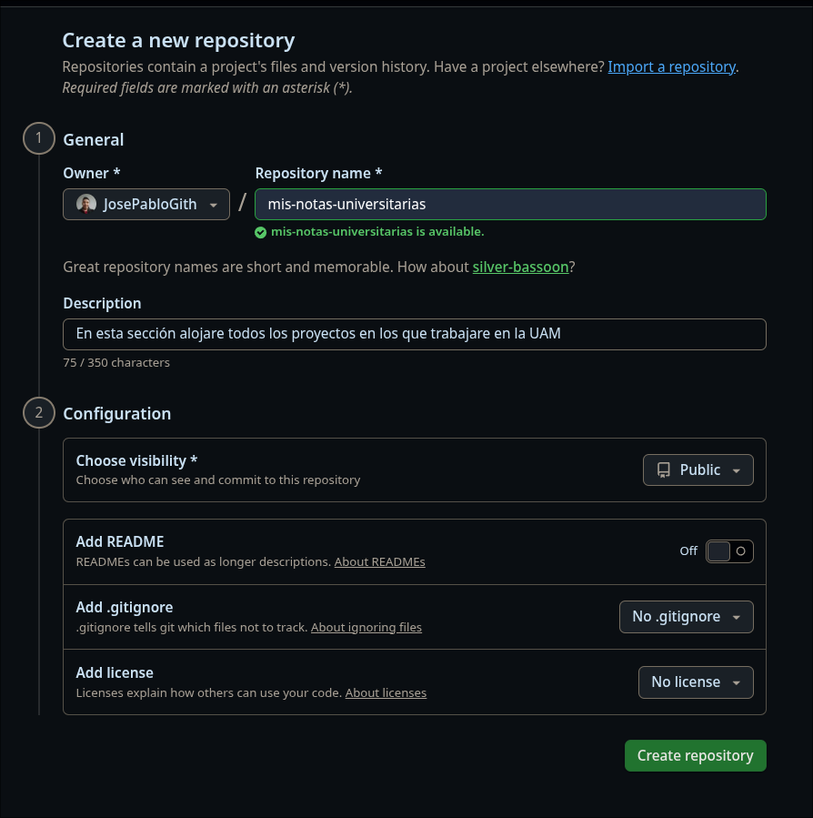

- **considerando la creación del repositorio**
  procedemos a vincular de manera manual la carpeta local
  con el enlace SSH de GitHub

```bash

# 1. Vincula de forma manual tu carpeta local con el enlace SSH de GitHub
git remote add origin git@github.com:JosePabloGith/mis-notas-universitarias.git

# 2. Sube tus apuntes por primera vez
git push -u origin main

```

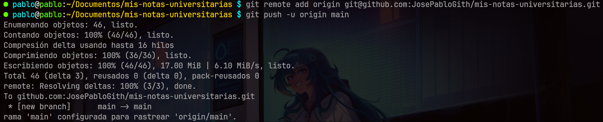

- Así es como se ve dentro de GitHub

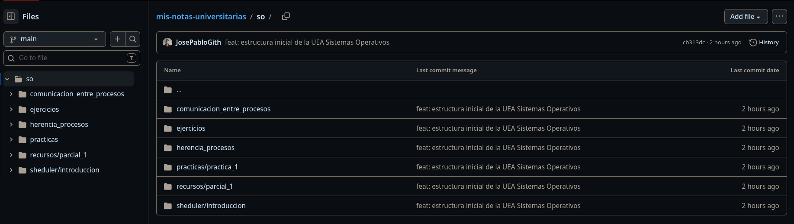

## ¿Que sucede si estamos dentro de otra maquina?

**Si estamos en otra maquina, como en Debian 12 virtualizada**, `NO` tenemos
que crear un repositorio nuevo desde cero. Lo que tenemos que hacer es
**"descargar"** y conectar el repositorio que ya tenemos.

- [ ] Esto es lo que se debe de hacer

1. En la terminal de la maquina debemos de pasar la llave ssh
   que conecta con nuestro GitHub. Este paso es
   el mas importante.

```bash
# recordando que primero debemos de generar la llave

ssh-keygen -t ed25519 -C "197368385+JosePabloGith@users.noreply.github.com"

```

- Vista de la consola Debian

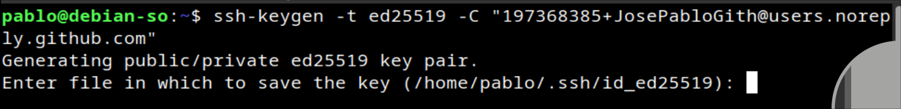

1. **Debemos de presionar enter y posteriormente presionar y**
2. Dejamos la contraseña en blanco para automatizar
   simplemente presionando enter 2 veces
   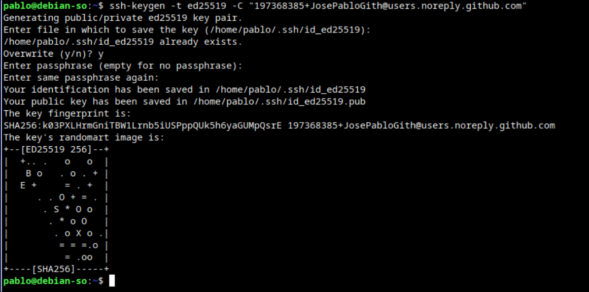
3. Registramos esa llave dentro de github
   para ello podemos usar `cat ~/.ssh/id_ed25519.pub` para
   ver ese contenido.
   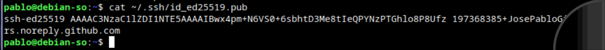

- Así se debe de ver dentro de GitHub
  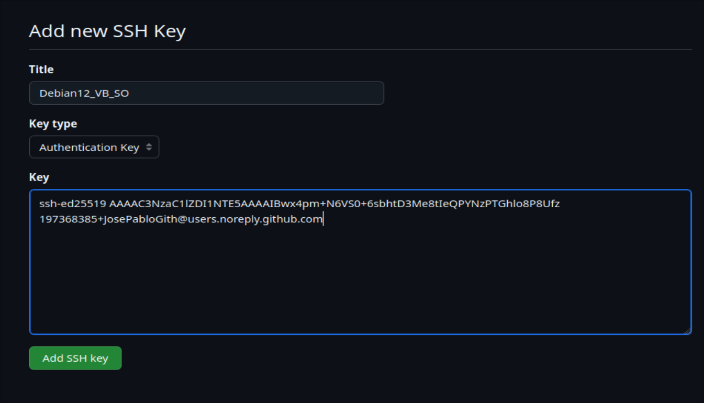

- Para que el SO recuerde la llave podemos usar

```bash

eval "$(ssh-agent -s)"
ssh-add ~/.ssh/id_ed25519

```

- Básicamente se vera asi:
  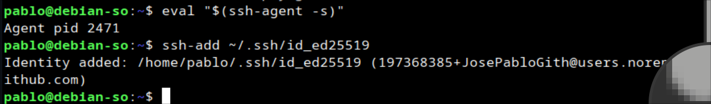

- pasamos a verificar la conexión
  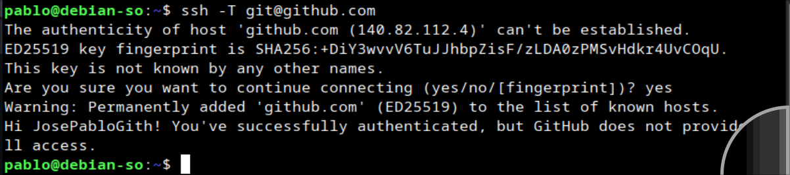

- Pasamos a clonar las notas

```bash
# usaremos este comando:
git clone git@github.com:JosePabloGith/mis-notas-universitarias.git

```

- si todo va bien se debería de ver esto:
  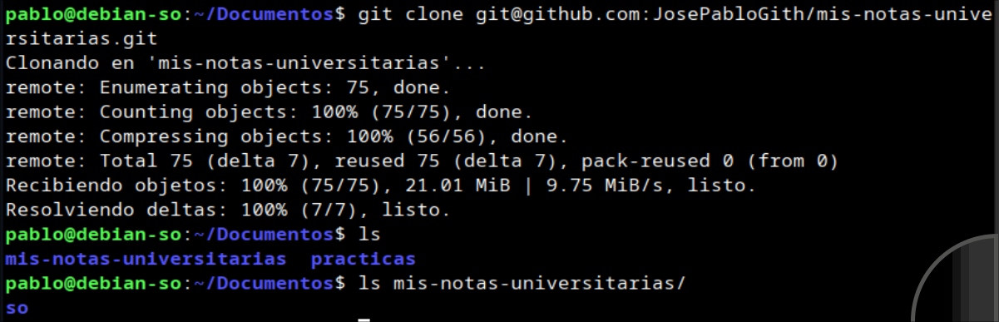

1. Debemos de preparar a la maquina ajena
   con las herramientas necesarias para entender git

   ```bash

    sudo apt update && sudo apt install git -y

   ```

2. En la terminal ajena, debemos de hacer lo siguiente:

```bash
cd ~/Documentos
git clone git@github.com:Tu_Usuario/mis-notas-universitarias.git
cd mis-notas-universitarias
```

- Con esto la maquina ajena tendrá la misma jerarquía que
  la maquina anfitrión

## Rutinas que se deben de seguir

- Esenario A: imagina que en el anfitrion actualizamos cosas
  entonces esto es lo que se debe de ejecutar

```bash

cd ~/Documentos/mis-notas-universitarias
git add .
git commit -m "docs: agregados apuntes de la clase de hoy"
git push origin main

```

- En este punto la maquina principal queda bien
  pero ¿la maquina virtualizada?
- Para actualizar el desactualizado debes de usar:

```bash
cd ~/Documentos/mis-notas-universitarias
git pull origin main

# Es la magia de poder usar git pull
# este comando va por gitHub por ssh, revisa
# si hay archivos nuevos a utilizar
# los descarga y los fuciona, de modo que se
# mantiene actualizado.

# ahora bien si solo quieres saber si hay
# cambios debes de usar
git fetch
git status
```
