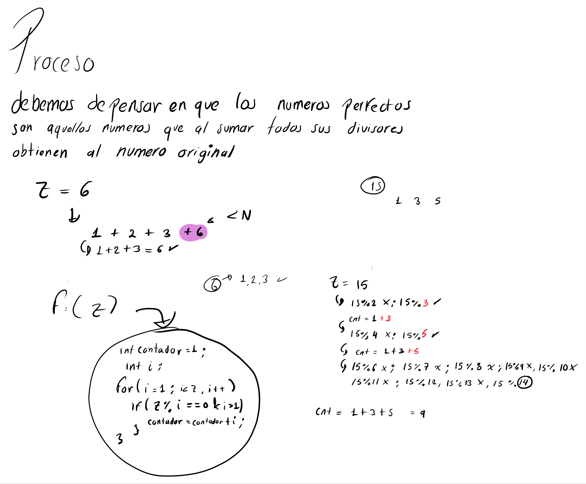

# Previamente [PIPE Anonimo]

- Anteriormente nos explicaron detalladamente
  el tema de comunicación entre tuberías
  **PIPES Anónimos**
- Se menciono que esas tuberías anónimas eran
  de naturaleza `temporal` lo que significa
  que `desaparecen en cuanto terminan los 
  procesos que las usan`

- solo **se pueden usar** con procesos que **posean**  relaciones entre si.

# FIFOs

- Aquí es donde entran las famosas tuberías
  explicitas.

Para que dos programas que no son familia 
se puedan comunicar necesitan un punto de encuentro.

**esto es lo que pasa con los programas**
- Como cuando usamos el navegador web y un servicio
  de música.

Este **`punto de encuentro`** es un `archivo 
especial` que **se crea** explícitamente dentro 
del disco duro.

- Al tener un nombre visible en el sistema, cualquier
  proceso con los permisos adecuados puede "abrirlo"
  y conectarse a él. No desaparece cuando el proceso
  muere, sino que vive en el sistema hasta que el 
  usuario o un programa lo borra.
  `semi-permanente`

## Recomendaciones

- [ ] Las FIFOs si permiten la comunicación
      bidireccional `PERO` casi `no se recomienda` 
      implementarlo
- imagina esta situación: 
  imagina que una `fifo es un tuvo de pvc`

- [ ] El proceso A grita un mensaje por un extremo 
      del tubo ("hola proceso B"), y rápidamente
      el proceso a coloca su oreja dentro del tubo
      para escuchar la respuesta del proceso B

- [ ] El SO maneja esto a velocidades altísimas y los
     datos simplemente se encolan en la 
     memoria del KERNEL, `existe una alta 
     po<sibilidad de el proceso A escuche un ECO`
     **de su propio saludo**, Antes de que el proceso
     B haya podido escucharlo. 

`ES POR ELLO QUE SE RECOMIENDA QUE SI SE NECESITA
QUE 2 PROCESOS SE COMUNIQUEN EN LOS FIFOs
SE DEBEN DE USAR CANALES SEPARADOS`

- FIFO 1: El proceso A solo tiene permiso de escribir
        y el B solo de leer.
- FIFO 2: EL proceso B solo tiene permiso de escribir
        y A solo de leer. 


# Implementación 

- CREACIÓN de el punto de encuentro:
  A diferencia de las anonimas que nacen en la RAM
  , las FIFOs necesitan existir físicamente en el 
    sistema de archivos.

### llamada al sistema:

```bash
mkfifo(const char *pathname, mode_t mode);

# donde pathname es : la ruta y nombre del archivo
#         por ejemplo "/tmp/mi_fifo_A_hacia_B"

# mode: representa los permisos del archivo. 
#      Usualmente 0666 (permisos de lectura
#      y escritura para dueño, grupos y otros).

# NOTA: solo un proceso debe de crear la FIFO.
#     si el archivo ya existe, mkfifo devolverá
#     un error (que podremos ignorar siempre y 
#     cuando recordemos que ya existia)

```

### Apertura y banderas (conexión al tubo)

En una FIFO, considerando que un archivo en disco, 
cada proceso debe de "abrir" su extremo usando la 
llamada estándar de archivos 
`open()`

- de la cual debemos de recordar esto: 

```c

open(const char *pathname, int flags);

// Donde debemos de recordar

// O_WRONLY : se usa si el proceso solo 
//        va a ESCRIBIR en la FIFO.
//  O_RDONLY: se usa si el proceso solo va a 
//      leer de la fifo
// Recuerda que 

```

### llamadas de transmisión (Lectura/Escritura)

Una vez que el FIFO está abierto y devuelve un 
descriptor de archivo (un numero entero), el 
envío y recepción de mensajes funciona exactamente 
igual que en las tuberías anónimas.

```c

// [*] Para escribir 
write(descriptor_fifo, &buffer, sizeof(buffer));

// [*] Para leer
read(descriptor_fifo, &buffer , sizeof(buffer));


```

### Cierre y destrucción (limpieza)

Como la FIFO es un archivo "semi-permanente", no 
desaparece por arte de magia, cuando los procesos
terminan. Debemos limpiar.

```c

// [*] cerrar la conexión: 
close(descriptor_fifo);

// [*] Eliminar el archivo: 
unlink("/tmp/mi_fifo_A_hacia_B");

```

### Alegorías para entender mejor

Imagina la serie Rick y Morty, donde Rick
usara su pistola de portales para crear 2
portales de diferente color.
Con la idea de cumplir un simple proposito.

| |  |
| :---: | :---: |


- La arquitectura de los 2 portales

1. Portal 1 (verde - De A a B): Usas
  mkfifo("/tmp/portal_verde",0666);
  El proceso A le pide datos por consola al usuario,
  se acerca al portal verde y **arroja los datos
  al portal** usando `write()`.

- Del otro lado, el proceso B esta parado frente al portal verde esperando
  atrapar esos números (usando `read`)

2. El procesamiento:
   B atrapa los números, hace su magia matemática y obtiene
   un **resultado**.
   `B se ve en la nececidad de usar otro portal` ya que usar 
   el mismo portal verde es peligroso por el tema de
   `condicion de carrera, o solapamiento de información`.

3. Portal 2 (Azul- De B hacia A):

Por eso se debe de crear el otro portal: 
- mkfifo("/tmp/portal_azul", 0666);.
- El proceso B ahora agarra el resultado y lo avienta por este nuevo portal
  azul


#### "¿A abrirá el portal y se quedará a la escucha?"

¡Sí, totalmente! Y lo hará de una forma muy eficiente. Aquí es donde entra un concepto técnico crucial de los Sistemas Operativos que llamamos Llamadas al Sistema Bloqueantes (Blocking calls).

Cuando el Proceso A intenta leer el "Portal Azul" usando la función read(), el Sistema Operativo (el Kernel) se da cuenta de que el tubo está vacío porque B aún está calculando. En lugar de dejar que A gaste energía (CPU) preguntando desesperadamente "¿Ya está? ¿Ya está? ¿Ya está?", el Sistema Operativo pone al Proceso A a "Dormir" (Estado Bloqueado).

Literalmente, A se queda congelado frente al portal. En el milisegundo exacto en que B avienta la respuesta por el portal azul, el Sistema Operativo "despierta" a A, A atrapa el dato, y continúa su ejecución felizmente.

(Dato curioso de nuestra teoría: Esto mismo aplica para la apertura. **Si A llega primero e intenta abrir el portal verde con open() para escribir, el Sistema Operativo lo dejará congelado hasta que B llegue y también le dé open() para leer.** `¡Los portales necesitan que ambos lados estén conectados para funcionar!)`

**EL FIFO BLOQUEARA EL PROCESO EN LA SECCION OPEN(), HASTA QUE EL OTRO
PROCESO ABRA EL MISMO FIFO**

# Actividad

Para nuestra actividad, se nos solicito realizar un pequeño 
coy probador de números perfectos. 
Para lograr eso primero hice unos calculos manuales



