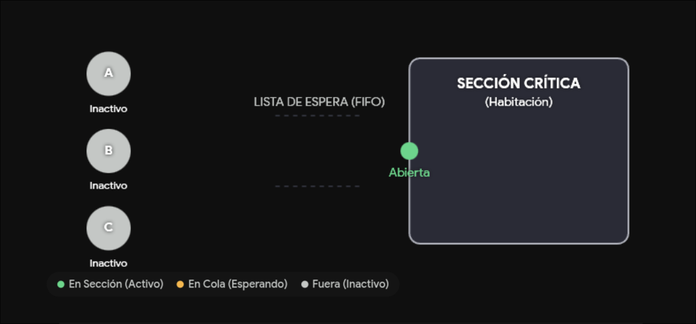
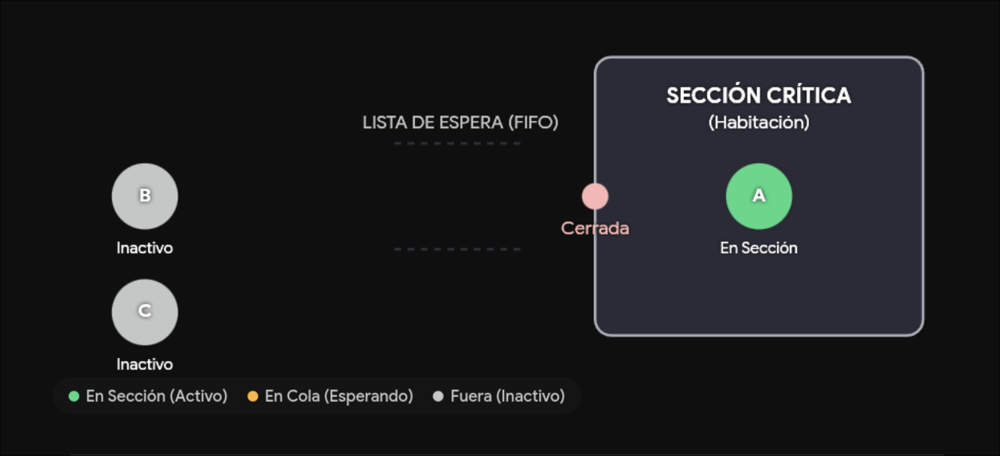
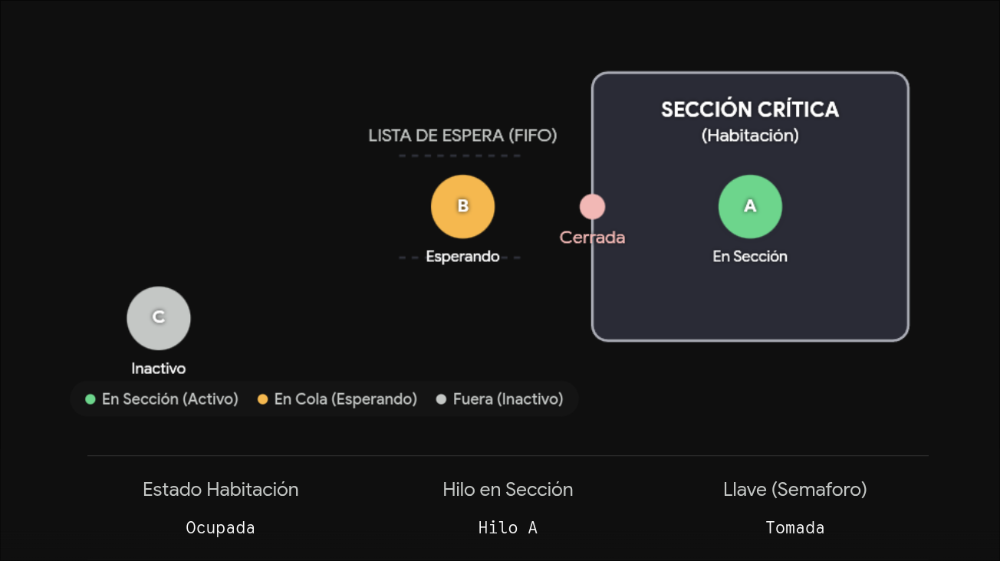
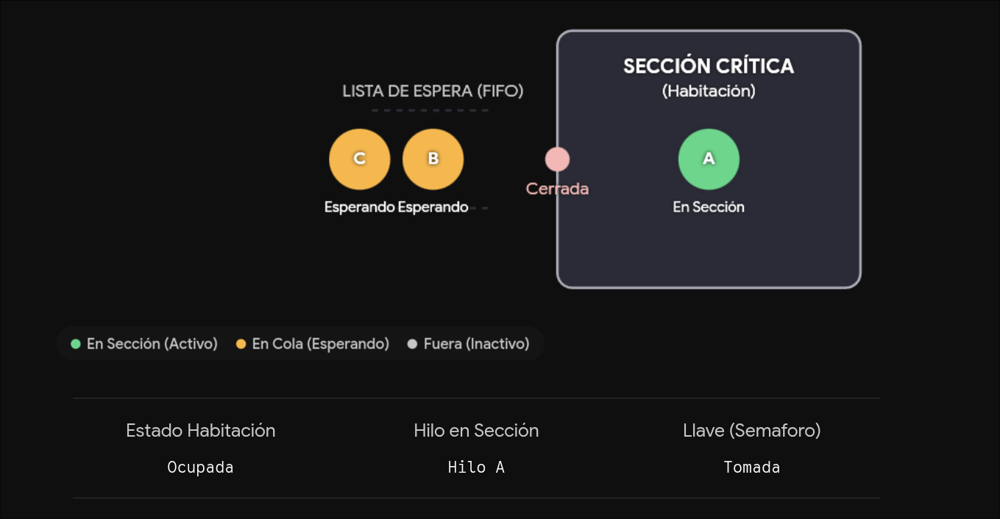
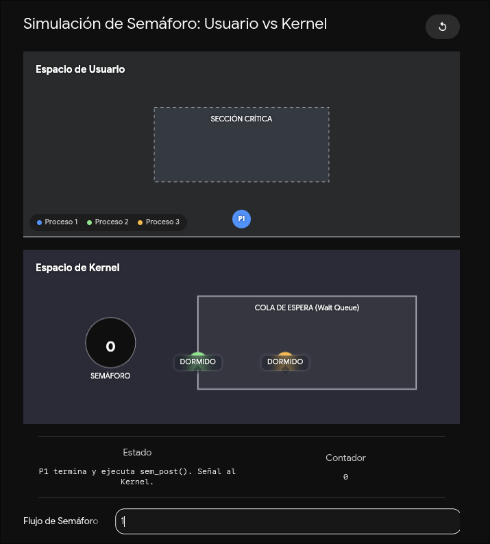

# semáforo binario

Un semáforo es un objeto gestionado por el sistema operativo
que posee un valor entero interno. Fue introducido originalmente
por el famoso cientifico de la computación Edsger Dajkstra.

Cuando este semáforo se utiliza especialemte como un candado (lock)
se le conoce como semáforo binario. Se llama binario porque
conceptualmente solo nos interesan dos estado del recurdo que protege:

- 1 "Disponible / no retenido": El camino está libre; un proceso puede
  entrar a la sección critica.

- 0 "no disponible / retenido": la sección crítica está ocupado por
  otro proceso o hilo.

  ## Operaciones fundamentales

  Para interactuar con un semáforo (bajo el estándar POSIX), unicamente
  disponemos de dos rutinas atómicas "es decir, que no pueden ser interrumpidas
  a la mitad"

  ### sem_wait() "Esperar / decrementar"

  - disminuye el valor del semáforo en 1

  ## Alegorias

  Un semáforo es una variavle especial que solo puede
  tomar números enteros positivos y sobre la cual los programas
  solo pueden actuar de forma atómica. Es decir, que no puede ser interrumpida
  a la mitad de la operacón. El semáforo binario es el tipo más
  simple de semáforo , ya que solo puede tomar los valores 0 y 1.

  Generalmente, se utilzan para proteger una "seccion critica" de codigo,
  garantizando que solo un hilo o proceso de ejecucion pueda ejecutarla
  en un momento dado (a esto se le llama exclusión mutua o mutex).

  ### Imagina esto

  - la seccion critica es una habitacion.
  - el semáforo binario es la única llave de la puerta de la habitación.
  - cuando un proceso llega a esa puerta y la llave
    esta disponible (semáforo en 1), la toma y asegura la puerta (semáforo en 0).
  - Si llega otro proceso y la llave no está, en lugar de quedarse parado
    desgastando la perilla (el famoso spinlock), anota su nommbre en una lista
    de espera y se va a dormir para no gastar recursos del procesador.

# Diferencias entre semáforo binario con el semáforo contador

1. Similitides: Ambos utilizan exactamente las mismoas funciones del sistema operativo
   (esperar y avisar) para manipularse y actúan de forma atómica.

2. diferencias: Mientras el semáforo binario restringe el accedo a
   un maximo de 1 proceso a la vez, el semáforo contador se inicializa con un numero
   mayor a uno.

3. Diferencia: El semáforo binario se usa para "exclusion mutua" estricta.
   El semáforo contador se usa cuando tienes un conjunto de recursos
   identicos y quieres permitir que un número limitado de hilos acceda
   simultaneamente; es como tener 5 lineas telefonicas disponibles y permitir que
   5 personas hablen al mismo tiempo.

# sintaxis semáforo binario

Historicamente, el creador de los semáforos (Edsger Dijkstra) llamó a las operaciones
P() para esperar y V() para soltar. En C (usando la libreria <semaphore.h>),
las funciones principales son:

- sem_init() : Inicializa el semáforo asignándole un valor inicial
  (1 para un binario, mayor a 1 para un contador).
- sem_wait() : [P()] Disminuye el valor del semáforo atomicamente. si
  el valor es 0, la funcion bloquea el hilo y lo pone a
  esperar hasta que el semáforo sea mayor a 0.
- sem_post() : [V()] Aumenta el valor del semáforo en 1 atómicamente.
  si había hilos dormidos esperando, despierta a uno de ellos.
- sem_destroy() : Libera los recursos del semáforo cuando el programa
  ya no los necesita.

## ejempolo visual

primero supondremos que 3 procesos A,B,C quieren acceder
a una seccion critica, si los 3 entran sin control
existira una condicion de carrera y el resultado final sera incorrecto.
Para evitar eso se usara un semáforo binario que solo permite que un proceso
entre a la seccion critica



### un hilo A: solicita entrar a la sección crítica

Cuando el proceso A llega a la seccion critica, el semáforo binario esta en 1
(disponible), por lo que A puede entrar sin problemas. Pero al entrar, el semáforo
se pone en 0 (ocupado) y A es el unico proceso que puede



## El hilo B solicita entrar a la sección crítica

Dado que el semáforo binario esta en 0 (ocupado), el proceso B no puede entrar
entonces el proceos B se bloquea y se pone a esperar hasta que el semáforo vuelva
a estar en 1 (disponible).



## El hilo C solicita entrar a la sección crítica

Dado que el proceso A esta ocupando la seccion critica
el proceso C no puede acceder, colocandose en la lista fifo de espera



## El proceso A termina de utilozar lo que esta en la sección crítica

Dado que el proceso A termino de usar la seccion critica, libera el semáforo
colocandolo en 1 (disponible) y despertando al proceso B que estaba esperando
"de cierta manera se le avisa que ya puede entrar a la seccion critica".

- ¿donde vive la fila de espera?

Esa fila no vive en el programa del usuario ni en la memoria
común de las aplicaciones. Vive dentro del kernel (el nucleo) del sistema operativo.

Cuando definimos un semáforo en nuestros codigos C
por ejemplo usando (**sem_t**), el sistema operativo crea tras
bambalinas una estructura de datos interna en el espacio del kernel.
Esta estructura de datos contiene principalemente estos datos:

1. Un contador entero (que es el valor del semáforo)
2. Un puntero a una estructura llamada cola de espera (wait queue) que
   contiene los hilos que estan esperando a que el semáforo se libere.

Por lo tanto, cada semáforo tiene su propia "lista de invitados VIP" que
están esperando a que se "abra la puerta"" guardada celosamente
por el kernel.

- ¿quien le avisa a la fila que la seccion critica se libero?

El encargado de avisar es el proceso o hilo que va saliendo de la sección
critica, pero no le avisa directamente a los otros procesos, sino que le da
el aviso al kernel al invocar la funcion **sem_post()**.

```c
/*
  [#] El mecanismo interno funciona siguiendo estos pasos
      cronologicos.

  [1] El aviso al kernel: El proceso que termina de usar la memoria
      compartida ejecuta la linea sem_post(&mi_semaforo);
      Esto provoca una llamada al sistema, pasandole el control
      temporal de la CPU al kernel.

  [2] El kernel actualiza el contador:
        El kernel atómicamente incrementa el valor del semáforo.

  [3] El kernel inspecciona la fila: Inmediatamente después de incrementar
      el valor, el kernel revisa la Wait Queue de ese semáforo en especifico.

  [4] El despertador del kernel:
      Si el kernel ve que hay procesos en la fila (los cuales estaban dormidos
      en un estado suspendido para no gastar CPU), toma al primero
      de la fila y cambia su estado de dormido a Ready.

  [5] El squeduler entra a la accion:
        En cuanto el proceso despierta y pasa al estado ready, el planificador
        de procesos del sistema operativo "scheduler" nota que ya puede volver a
        competir por la CPU. En cuanto le asigna un turno de ejecucion, el
        proceso despertado sale del bloqueo de su propio sem_wait()
        y entra triunfalmmente a la seccion critica.


*/

```





De esta manera continua el ciclo de liberacion, bloqueo.

## herramientas que necesitamos

### UNION

En C una union es un tipo de dato especial donde
todas las variables que declaradas adentro comparten
el mismo espacio de memoria (solo se puede usar una a la vez).

### ¿union semun?

Para configurar o borrar un semaforo en sistem V (usando semctl), el estándart
requiere que le pases esta unión. Usualmente contiene un número entero
`int val` (para darle el valor inicial de 1 al semaforo), un puntero
a una estructura `struct semid_ds *buf`, y un arreglo unsigned short \*array (para inicializar varios semaforos a la vez).

### ¿que es struct sembuf?

En sistem V, para decirle al kernel "quiero hacer un wait" o "quiero hacer un post",
debes llenar una estructura `struct sembuf` con los siguientes campos:

1. el numero del semáforo `sem_num`
2. la operacion que que quieres hacer `sem_op`
   (por ejemplo -1 para wait, +1 para post "liberar")
3. banderas sem_flg (para decirle al kernel si quieres que la operacion sea bloqueante o no)

### semáforos POSIX: la forma moderna y sencilla

Si decides usar la forma moderna (POSIX), la única "estructura" con la que te vas a comunicar es un tipo de dato opaco llamado sem_t. Tú no necesitas saber qué hay adentro de sem_t, el Sistema Operativo lo maneja por ti; tú solo le pasas su dirección de memoria (&).

Aquí están las funciones, sus parámetros especiales y dónde se deben ubicar en la estructura de tu código en C:

- A. Inclusión de librerías (Al inicio de tu archivo)
  Debes incluir la librería especial para semáforos:

```c
#include <semaphore.h>
#include <pthread.h> // Si usas hilos
```

- B. Declaración de la estructura (Globalmente)

Debes declarar tu variable semáforo de tipo sem_t. Es buena práctica declararla globalmente si vas a usar hilos, para que todos los hilos puedan ver "la misma puerta y la misma llave".

```c
sem_t mi_semaforo;
```

- C Inicialización (Dentro del main, antes de crear hilos/procesos)

- [ ] Usas la función sem_init().

- [ ] Parámetro 1: La dirección de memoria del semáforo (&mi_semaforo).

- [ ] Parámetro 2 (pshared): Ponlo en 0 si vas a compartir el semáforo entre hilos del mismo proceso. Ponlo en un valor distinto de cero si es entre procesos distintos.

- [ ] Parámetro 3 (value): El valor inicial. Para un semáforo binario (un candado simple), ponlo en 1.

```c
int main() {
    sem_init(&mi_semaforo, 0, 1);
    // ... aquí creas tus hilos ...
```

- D. La Sección Crítica (Dentro de la función que ejecutan tus procesos/hilos)

Aquí usas las funciones que cambian de 1 a 0 y de 0 a 1.

- sem_wait(&mi_semaforo); -> El proceso intenta entrar. Si el semáforo está en 1, lo pasa a 0 y entra. Si está en 0, el Sistema Operativo lo forma en la fila y lo duerme.

- sem_post(&mi_semaforo); -> El proceso termina y sale de la habitación. Pasa el semáforo a 1 y el SO despierta al siguiente en la fila.

```c
void* mi_funcion_hilo(void* arg) {
    // Código normal...

    sem_wait(&mi_semaforo);  // ---- INICIO SECCIÓN CRÍTICA ----

    // Aquí modificas tus variables compartidas o hardware
    // ¡Estás seguro! Nadie más puede estar aquí.

    sem_post(&mi_semaforo);  // ---- FIN SECCIÓN CRÍTICA ----

    // Código normal...
}
```

- E. Destrucción (Al final del main)
  Cuando todos terminaron, debes limpiar los recursos que el Kernel reservó.

```c
// ... después de que los hilos terminan ...
    sem_destroy(&mi_semaforo);
    return 0;
}
```

### ¿que es un hilo?

En los sistemas operativos modernos, un proceso puede tener múltiples hilos de ejecución. Un hilo es la secuencia de instrucciones más pequeña que el sistema operativo puede administrar y enviar a procesar a la CPU.

Para visualizarlo, usemos una alegoría de una fábrica:

- El Proceso es la fábrica entera: Tiene el terreno, la electricidad, las herramientas y los planos (es decir, comparte la misma memoria virtual, el área de datos, el código del programa y el heap).

- Los Hilos son los trabajadores dentro de esa fábrica: Una misma fábrica puede tener a varios empleados haciendo tareas distintas de forma simultánea. Por ejemplo, en tu navegador web (que es un proceso), un hilo se encarga de descargar un archivo, otro reproduce un video y otro detecta los clics de tu mouse.

#### ¿que comparten y que no comparten?

Como todos los "trabajadores" (hilos) están dentro de la misma "fábrica" (proceso):

- Comparten la memoria y los recursos globales: Todos están ejecutando el mismo código y pueden acceder a las mismas variables globales. Por eso, comunicarse entre ellos es rapidísimo.

- Tienen su propio "bloc de notas" privado: Cada hilo tiene su propia pila (o stack). Esto significa que, aunque comparten el entorno general, cada hilo lleva la cuenta independiente de en qué línea de código va, qué funciones está llamando y mantiene aisladas sus propias variables locales.

#### ¿por qué se relacionan tanto con los semáforos?

Justamente por compartir el mismo espacio de trabajo. Si dos trabajadores (hilos) intentan usar la misma máquina o modificar la misma variable global exactamente al mismo tiempo sin ponerse de acuerdo, van a corromper los datos (a esto se le llama una condición de carrera o race condition). ¡Y ahí es exactamente donde entra el semáforo binario para poner orden y decir "solo pasa uno a la vez"!
